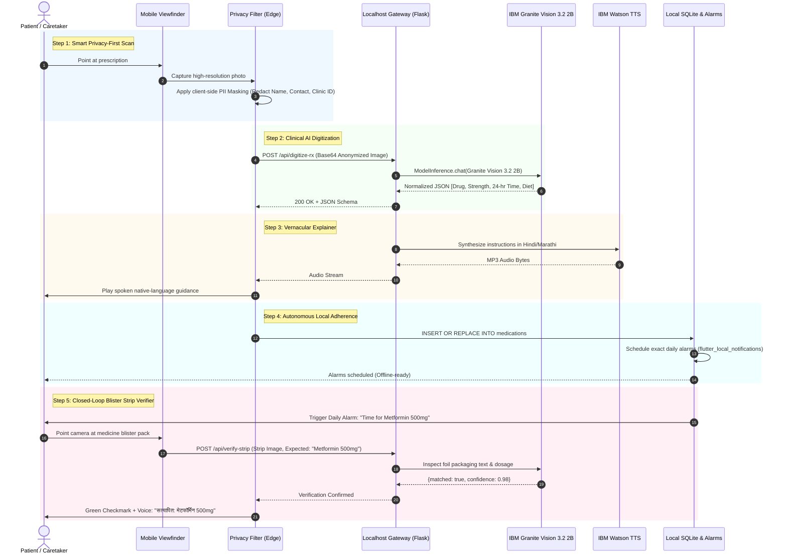

# Aarogyam: Project Alpha — Technical Architecture

> **System Design & Technical Architecture Document**  
> Version: 2.0 (Project Alpha)

---

## 1. System Topology

Aarogyam connects an **Edge-Centric Flutter Mobile Client** with a high-performance **Localhost/Edge Flask Backend Gateway** communicating securely with **IBM WatsonX AI** foundation models.

```
┌────────────────────────────────────────────────────────────────────────┐
│                        Aarogyam Android Client                         │
│                                                                        │
│  ┌──────────────────────┐  ┌────────────────────┐  ┌────────────────┐  │
│  │ 1. Privacy-First Rx  │  │  3. Vernacular     │  │ 5. Blister Pack│  │
│  │    Camera & Masking  │  │     Voice Player   │  │    Pill Verifier│  │
│  └──────────┬───────────┘  └─────────▲──────────┘  └────────┬───────┘  │
│             │                        │                      │          │
│             ▼                        │                      ▼          │
│  ┌──────────────────────┐            │             ┌────────────────┐  │
│  │ 2. Rx Digitization   │            │             │ Verification   │  │
│  │    Response Handler  │            │             │ Badge & Speech │  │
│  └──────────┬───────────┘            │             └────────────────┘  │
│             │                        │                                 │
│             ▼                        │                                 │
│  ┌───────────────────────────────────┴──────────────────────────────┐  │
│  │ 4. Autonomous Local Adherence (SQLite `dbaarogyam.db`)           │  │
│  │    Timezone-Aware Android AlarmManager & Local Notifications     │  │
│  └───────────────────────────────────┬──────────────────────────────┘  │
└──────────────────────────────────────┼─────────────────────────────────┘
                                       │
                    HTTPS over Cloudflare Tunnel / USB (adb reverse)
                                       │
                                       ▼
┌────────────────────────────────────────────────────────────────────────┐
│                 Consolidated Local Gateway (Flask :5001)                │
│                                                                        │
│  • POST /api/digitize-rx          • POST /api/verify-strip             │
│  • POST /api/vernacular-tts       • GET /api/health                    │
└───────────────────┬────────────────────────────────┬───────────────────┘
                    │                                │
                    ▼                                ▼
┌──────────────────────────────────────┐  ┌──────────────────────────────┐
│ IBM WatsonX.ai Platform              │  │ IBM Watson Speech Services   │
│ Model: `ibm/granite-vision-3.2-2b`   │  │ Service: Text-to-Speech API  │
│ - Zero-shot clinical handwriting OCR │  │ Voice: hi-IN (Hindi) / mr-IN │
│ - Blister strip text & foil parsing  │  │ - Natural speech synthesis   │
└──────────────────────────────────────┘  └──────────────────────────────┘
```

---

## 2. End-to-End 5-Step Sequence Diagram



---

## 3. Data Schemas & API Contracts

### A. Endpoint: `POST /api/digitize-rx`
Processes the anonymized prescription image and normalizes it into structured clinical JSON.

#### Request Payload:
```json
{
  "image_base64": "data:image/jpeg;base64,...",
  "language": "hi" // "hi" for Hindi, "mr" for Marathi, "en" for English
}
```

#### Response Payload (200 OK):
```json
{
  "status": "success",
  "data": {
    "doctor_specialty": "General Physician",
    "medications": [
      {
        "id": 1,
        "name": "Metformin",
        "strength": "500mg",
        "form": "Tablet",
        "frequency": "BD",
        "timing_24hr": ["08:30", "20:30"],
        "food_relation": "After Food",
        "instructions": "Take with water immediately after breakfast and dinner",
        "instructions_vernacular": "खाना खाने के तुरंत बाद सुबह और रात को एक गोली लें"
      },
      {
        "id": 2,
        "name": "Amlodipine",
        "strength": "5mg",
        "form": "Tablet",
        "frequency": "OD",
        "timing_24hr": ["09:00"],
        "food_relation": "Before Food",
        "instructions": "Take once daily in the morning",
        "instructions_vernacular": "सुबह खाली पेट एक गोली लें"
      }
    ],
    "vernacular_audio_url": "/api/audio/rx_summary_172746.mp3"
  }
}
```

---

### B. Endpoint: `POST /api/verify-strip`
Validates whether the medicine packaging being shown to the camera matches the patient's scheduled medication.

#### Request Payload:
```json
{
  "image_base64": "data:image/jpeg;base64,...",
  "expected_drug": "Metformin",
  "expected_strength": "500mg",
  "language": "hi"
}
```

#### Response Payload (200 OK):
```json
{
  "status": "success",
  "verified": true,
  "detected_text": "METFORMIN HYDROCHLORIDE TABLETS IP 500 MG",
  "confidence_score": 0.96,
  "voice_alert_vernacular": "सत्यापित: यह मेटफॉर्मिन 500mg की गोली है। कृपया इसे पानी के साथ लें।",
  "action": "ALLOW_CONSUMPTION"
}
```

#### Mismatch Response (200 OK with alert):
```json
{
  "status": "success",
  "verified": false,
  "detected_text": "AMLODIPINE BESYLATE TABLETS IP 5 MG",
  "confidence_score": 0.94,
  "voice_alert_vernacular": "चेतावनी! यह गलत दवा है। यह एम्लोडिपिन है, मेटफॉर्मिन नहीं। इसे न लें।",
  "action": "BLOCK_CONSUMPTION"
}
```

---

### C. SQLite Schema (`dbaarogyam.db`)

All active prescriptions are mirrored locally on the Android device for 100% offline resilience:

```sql
CREATE TABLE IF NOT EXISTS medications (
    id INTEGER PRIMARY KEY AUTOINCREMENT,
    title TEXT NOT NULL,          -- e.g. "Metformin 500mg"
    message TEXT NOT NULL,        -- Instructions / Vernacular guide
    hour INTEGER NOT NULL,        -- e.g. 8
    minute INTEGER NOT NULL,      -- e.g. 30
    turnedon INTEGER DEFAULT 1,   -- 1 = Active, 0 = Paused
    food_relation TEXT,           -- "After Food" / "Before Food"
    vernacular_text TEXT          -- Spoken script for offline TTS
);
```

---

## 4. Responsible AI & Safety Guardrails (Week 2 Compliance)

1. **Client-Side PII Redaction**:
   * Patient name, mobile number, clinic address, and insurance ID are redacted on the client before the payload leaves the handset.
2. **Deterministic Confidence Threshold**:
   * If Granite Vision's OCR reading on the blister foil is below `0.80` confidence, the app flags: *"Unclear packaging. Please consult your pharmacist or family member."*
3. **Emergency Symptom Triage**:
   * If a user queries critical emergency symptoms, the system bypasses AI generation and renders the emergency contact card directly.
4. **Human-in-the-Loop Verification**:
   * The patient or caregiver retains final visual approval over the generated table before alarms are registered.
