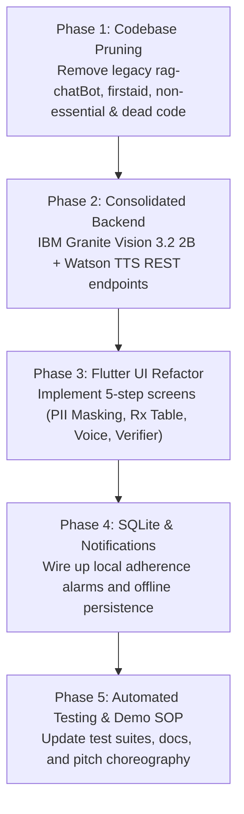

# Aarogyam: Project Alpha — Master Implementation Plan

> **Vernacular Prescription Guardian & Blister Strip Pill Verifier**  
> *Transforming handwritten doctor prescriptions into private, voice-guided, verified daily medication routines for multilingual India.*

---

## 1. Executive Summary & Problem Statement

### The Problem
In India and developing nations, over **50% of chronic patients do not take medications as prescribed (WHO)**. The root causes are:
1. **Illegible Doctor Handwriting & Medical Shorthand** (e.g., *Rx, Tab PCM 500mg 1-0-1 PC*).
2. **Language & Literacy Barriers**: Prescriptions are written in English, while millions of patients speak Hindi, Marathi, or other Indic languages.
3. **Accidental Wrong-Pill Ingestion**: Visually impaired or elderly patients with polypharmacy frequently mix up identical-looking blister packs.
4. **Cloud Privacy & Connectivity Vulnerabilities**: Rural primary health centres (PHCs) suffer from spotty networks, while uploading raw medical records to public cloud models violates patient privacy (DPDP Act / HIPAA).

### The Solution (Project Alpha)
A focused, 5-step closed-loop prescription guardian powered by **IBM Granite Vision 3.2 2B**, **IBM Watson Text-to-Speech**, and **Offline-First Android Architecture**:

```
┌────────────────────────────────────────────────────────────────────────┐
│        Aarogyam: Vernacular Prescription Guardian & Pill Verifier       │
│                                                                        │
│  STEP 1: SMART PRIVACY-FIRST SCAN (Edge / On-Device)                   │
│  • Patient captures handwritten prescription                           │
│  • Client-side image enhancement (deskew, contrast, crop)              │
│  • On-device PII Masking: Redacts patient name, address, phone number  │
│    before any image byte leaves the device                             │
│                                                                        │
│  STEP 2: CLINICAL AI DIGITIZATION (IBM Granite Vision)                 │
│  • Anonymized Rx image processed by IBM Granite Vision 3.2 2B          │
│  • Decodes illegible doctor handwriting & clinical abbreviations       │
│    (Rx, OD, BD, TDS, AC, PC)                                           │
│  • Normalizes into structured JSON: [Drug, Strength, Timing, Diet]     │
│                                                                        │
│  STEP 3: VERNACULAR EXPLAINER ("Dadi-Ma Mode" via Watson TTS)          │
│  • Converts clinical drug jargon into simple, spoken instructions      │
│  • High-clarity native audio synthesis in Hindi & Marathi              │
│  • "यह नीली गोली (Paracetamol) खाना खाने के बाद रात 8 बजे लेनी है"     │
│                                                                        │
│  STEP 4: AUTONOMOUS LOCAL ADHERENCE (Offline-First)                    │
│  • Ingests schedule directly into the offline SQLite database          │
│  • Registers exact, battery-optimized daily alarms via Android         │
│    AlarmManager & Local Notifications (Zero cloud dependency)          │
│                                                                        │
│  STEP 5: CLOSED-LOOP BLISTER STRIP VERIFIER (Proof-of-Consumption)     │
│  • Alarm sounds ──► Patient points camera at medicine blister pack     │
│  • Granite Vision validates: Does strip foil match scheduled dose?     │
│  • Spoken Voice Confirmation prevents lethal wrong-pill mix-ups        │
└────────────────────────────────────────────────────────────────────────┘
```

---

## 2. Elimination of Unnecessary & Irrelevant Code (The Pruning Plan)

To transition from the unfocused "Project Beta" into the razor-sharp "Project Alpha", all legacy, unrelated, and dead codes will be completely removed from the working tree:

### Modules & Directories Slated for Removal:
| Path | Reason for Removal |
|---|---|
| `rag-chatBot/` | Legacy RAG chatbot querying Ayurvedic PDF dataset. Disconnects from the core prescription guardian mission and introduces clinical liability risks. |
| `firstaid-object-storage/` | Legacy IBM COS first aid image gallery. Completely irrelevant to prescription digitization and blister strip verification. |
| `non-essential-resources/` | Stale prototyping notebooks, CPR images, and legacy burn assets. |
| `aarogyam-flutter/lib/copy_pages/` | Dead FlutterFlow test screens (`allergies_p_age_copy`, `profile`, `response_page`). |
| `aarogyam-flutter/lib/dbpageee/` | Unused raw SQLite test screen. |
| `aarogyam-flutter/lib/custom_query/` | Unused query screen. |
| `aarogyam-flutter/test/widget_test.dart` | Broken default counter-app template test. |
| Redundant legacy actions | `extract_text_from_h_t_m_l.dart`, `extract_text_from_h_t_m_l_file.dart`, `translate_html_file.dart`. |

---

## 3. Backend Modernization & Consolidation Plan

We will consolidate and evolve `lvm-watsonx/` into a single, clean **`backend/`** service:

### Target Architecture:
* **Framework**: Python 3.10+ / Flask 3.1 / Gunicorn.
* **Core Model**: **IBM Granite Vision 3.2 2B** (`ibm/granite-vision-3.2-2b` or `ibm/granite-3.2-vision-preview`), replacing third-party Mistral Pixtral 12B.
* **TTS Engine**: IBM Watson Text-to-Speech API (with native Hindi & Indian English voice profiles).
* **Endpoints**:
  1. `POST /api/digitize-rx`: Accepts anonymized base64 Rx image, prompts Granite Vision to return clean JSON with normalized 24-hr dosage schedules.
  2. `POST /api/verify-strip`: Accepts blister strip image and target medicine name, prompts Granite Vision to verify match and return boolean match status + spoken feedback text.
  3. `GET /api/health`: Health status and model readiness.

---

## 4. Mobile Client Refactoring Plan (`aarogyam-flutter/`)

The mobile client will be streamlined into a 5-step coherent user experience:

### 1. Privacy-First Rx Scanner Screen
* Real-time camera capture with automatic bounding box.
* Client-side PII masking overlay to blackout patient/doctor headers before transmission.
* Direct upload to `/api/digitize-rx`.

### 2. Clinical Schedule & Vernacular Audio Screen
* Displays extracted medications with dosage tags (Morning, Afternoon, Night, Food instructions).
* Interactive audio player powered by Watson TTS streaming vernacular Hindi/Marathi audio.
* "Save to Schedule" button that commits records directly to SQLite (`dbaarogyam.db`).

### 3. Medication Manager & Reminders Screen
* Clean list of active daily medications with toggle switches.
* Uses `flutter_local_notifications` with timezone-aware `exactAllowWhileIdle` alarms.

### 4. Blister Strip Verifier Camera Screen
* Triggered directly from medication reminders or quick-action button.
* Live camera viewfinder directing the patient to *"Show your medicine strip"*.
* Real-time visual badge (Green Checkmark / Red Alert) + voice confirmation: *"Verified: Metformin 500mg. Take with water."*

---

## 5. Live Demo & Hackathon Strategy (Zero Cold-Start Guarantee)

* **Localhost + Tunneling**:
  * Run the consolidated Flask backend locally on the demo laptop (`localhost:5001`).
  * Tunnel via **Cloudflare Tunnels (`cloudflared`)** for persistent, zero-latency HTTPS.
  * **Fallback Plan**: Direct USB connection via `adb reverse tcp:5001 tcp:5001` (guarantees $<1\text{ ms}$ latency even if venue Wi-Fi completely collapses).
* **IBM Bob Integration Proof**:
  * Document how IBM Bob generated the Granite Vision prompt engineering, SQLite schema updates, and test suite.

---

## 6. Implementation Milestones


